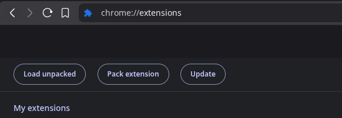
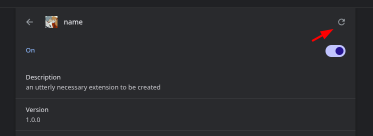

# Chrome extension starter code

My setup for writing chrome extensions (manifest v3) with TypeScript and Bun

I didn't had the need to support manifest v2 extensions yet

## How to use

This extension is designed with two parts:

- The injector (injection.js), which is registered as a content scripts, and
  loaded in a selected group of pages (or any)

- The actual code, which is located in `src/main.ts`

Because the code is written in TypeScript, a compile and bundle state must be
done before testing/publishing your code.

```console
bun run build.ts
```

## How to test

Go to `chrome://extensions`, enable de Developer Mode switch, and click
"Load unpacked"



Select the directory for this project, and test that the script being injected
correctly. When testing changes, make sure you rebuild the code and reload the
extension



## Useful links

- Manifest v3 specification <https://developer.chrome.com/docs/extensions/reference/manifest>
- Permissions <https://developer.chrome.com/docs/extensions/reference/api/permissions>
